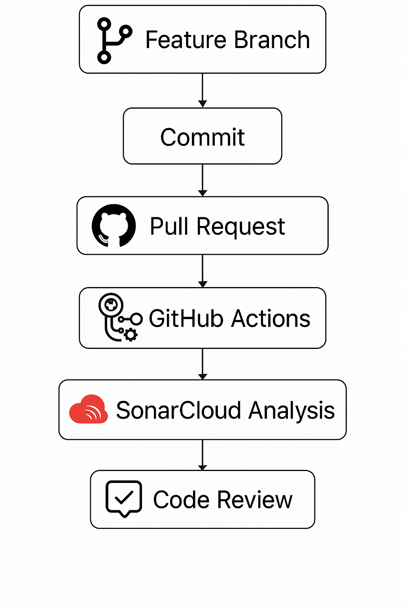
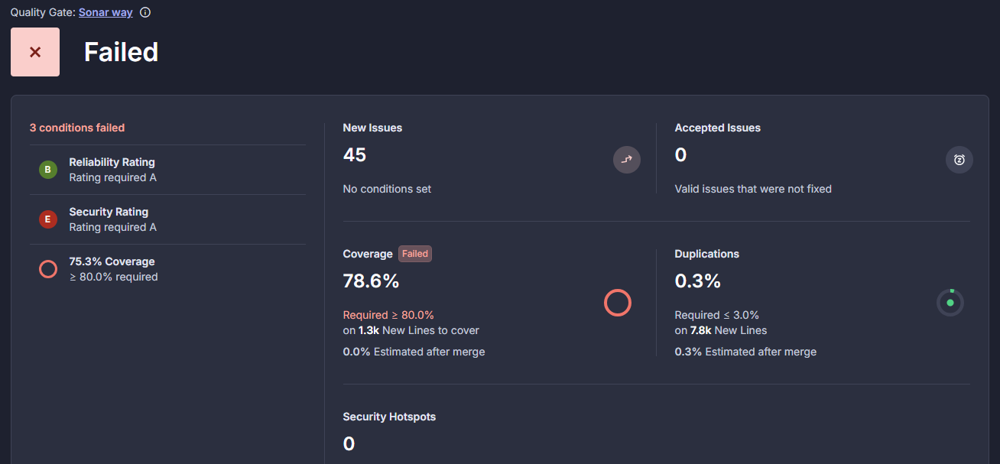
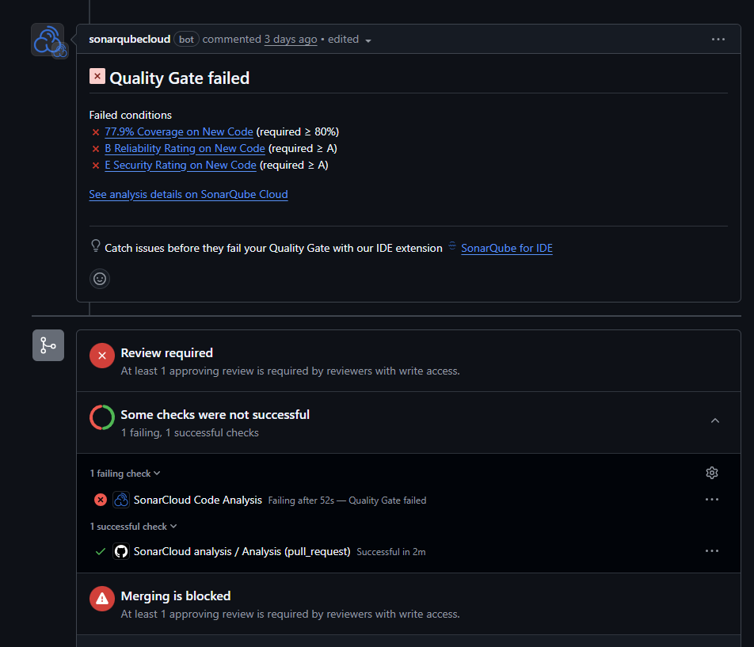
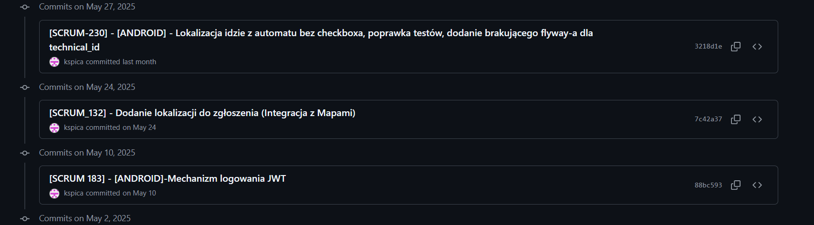
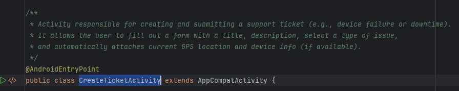
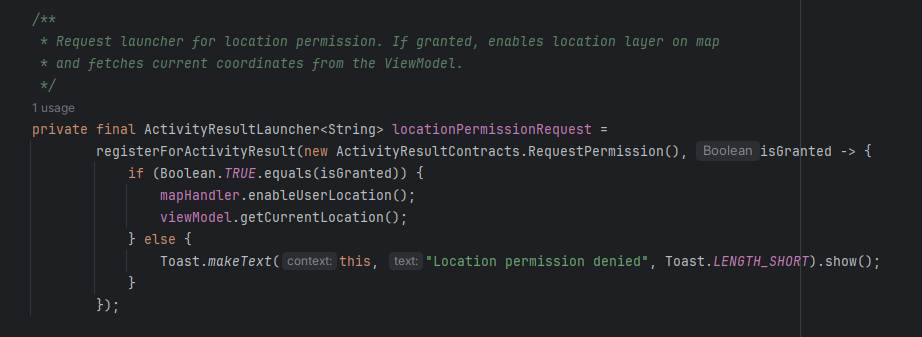
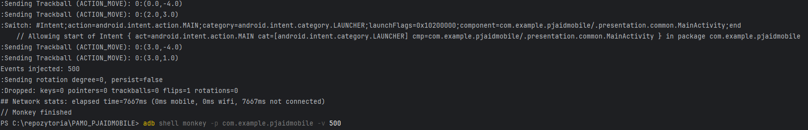

# Mobile Application for Reporting and Managing Device Failures within the PJAID System

MVP (Minimum Viable Product)
- Failure report registration
- QR code scanning
- User's list of reports
- Report details


## Team & task division

| Person              | Tasks                                                            |
|---------------------|------------------------------------------------------------------|
| Jakub Marcinkowski  | [ANDROID] Formularz zgłoszenia awarii, Lista zgłoszeń użytkownika|
| Dagmara Gibas       | [ANDROID] Szczegóły zgłoszenia                                   |
| Karol Spica         | [ANDROID] Dodanie odczytywanie QR kodu w aplikacji mobilnej      |
------------------------------------------------------------------------------------------
## Short Description of the Application

PJAID Mobile is a mobile application for reporting and managing technical failures in industrial equipment, mainly targeted at technicians and maintenance personnel. The key features include:
-	Submitting reports via a dedicated form
-	Describing the issue, setting the status, and adding a location (via GPS or manually)
-	Viewing a user-specific list of reported issues
-	Editing and updating ticket details
-	Google Maps integration for location display
-   QR code scanning for identifying equipment

# Git usage instructions

Source code management in the project team was based on the GIT version control system. Below are the best practices followed during work with the repository.


## Tworzenie brancha

- Zanim rozpoczniesz pracę nad nową funkcjonalnością lub poprawką, utwórz nowy branch.  
- Dzięki temu nie będziesz ingerować w główną gałąź projektu (main).  
- Każda zmiana powinna być realizowana w osobnym branchu.  
- W przypadku dłuższej pracy commituj zmiany regularnie.

## Pull Request i Code Review

Po zakończeniu pracy nad funkcjonalnością:

1. Przejdź na platformę **GitHub** i utwórz **Pull Request (PR)**.  
2. Jako gałąź roboczą wskaż **swój branch**, jako docelową – **main**.
3. Inni członkowie zespołu dokonują przeglądu kodu (Code Review), który obejmuje:
   - sprawdzenie logiki implementacji,
   - zgodność ze standardami kodowania,
   - weryfikację braku błędów.
4. Wprowadź poprawki zgodnie z uwagami i wykonaj kolejny commit — zmiany zostaną automatycznie dołączone do istniejącego PR.

## Testowanie i scalanie zmian

- Przed zatwierdzeniem PR, dokładnie przetestuj swój branch.
- Upewnij się, że nie występują błędy oraz że wszystkie testy jednostkowe i integracyjne przechodzą poprawnie.
- Po pomyślnym mergowaniu do main, usuń swój branch lokalnie i zdalnie.

## Konwencje nazewnictwa

### Nazwy branchy:

`SCRUM_NUMER_TASKA_krotki_opis`

**Przykład:**  
`SCRUM_4_konfiguracja_bazy`

### Opisy commitów:
```
[SCRUM 4] - krótki opis tego co robią commitowane zmiany
```

## Podsumowanie

1. Twórz nowy branch przed każdą zmianą  
2. Commituj zmiany regularnie  
3. Twórz Pull Requesty po zakończeniu pracy  
4. Przeprowadzaj Code Review przed mergowaniem  
5. Scalaj tylko przetestowany kod  
6. Usuwaj nieaktualne branche

---

# Instrukcja korzystania z Sonara

- Warto do IDE zainstalować sobie wtyczkę **SonarQube for IDE** (dla użytkowników IntelliJ).  
- Wtyczka dodaje do menu kontekstowego opcję:  
  **"Analyze with SonarCube for IDE"**.  
- Po uruchomieniu tej opcji pojawią się **informacje o tym, co należy poprawić w kodzie**.
- Warto mieć ją zainstalowaną lokalnie, ponieważ na GitHub dodane zostały tzw. **GitHub Actions**, które **automatycznie uruchamiają analizę Sonara**.
- Jeśli kod **nie przejdzie analizy pozytywnie**, możliwość jego mergowania zostanie **zablokowana**.

---

## Pełen workflow CI/CD zastosowany w projekcie



Kod źródłowy jest analizowany przez SonarCloud pod kątem:
- błędów
- luk bezpieczeństwa (Security Hotspots, Bugs, Code Smells)
- pokrycia testami

# Sonar example


# Pull request example


# Commits example



Dokumentacja kodu była prowadzona przy użyciu JavaDock. Komentarze staraliśmy się umieszczać na poziomie klas oraz metod które według nas tego wymagały. 
# Class commit example



# Method commit example



# Testy jednostkowe (Unit tests)
## Narzędzia:
JUnit
 – Framework testowy do testów jednostkowych i instrumentacyjnych
 – Używany do: @Test, @Before, @After, assertEquals, itd.


Mockito
 – Biblioteka do mockowania obiektów i weryfikacji interakcji
 – Używany do: mock(), when(), verify(), @Mock, mockStatic()


Espresso
 – Biblioteka do testów UI – interakcje z widokami (onView(), withId(), perform(), check())


AndroidJUnitRunner
 – Androidowy runner do uruchamiania instrumentacyjnych testów (@RunWith(AndroidJUnit4.class))


UIAutomator
 – (niewykryty w liniach kodu, ale zadeklarowany w build.gradle.kts) – służy do testowania interfejsów zewnętrznych, np. dialogów systemowych, powiadomień


## Przykładowe klasy z testami jednostkowymi:
- GetDeviceByIdUseCaseTest.java – test logiki pobierania urządzenia
- SendReportUseCaseTest.java – test logiki wysyłki zgłoszenia
- TokenAuthenticatorTest.java – test klasy odpowiedzialnej za autoryzację JWT/tokeny


## Testy instrumentacyjne (Instrumented tests)
Przykładowe klasy z testami instrumentacyjnymi:
- MainActivityTest.java – test działania MainActivity
- CreateTicketActivityTest.java – test działania ekranu zgłoszenia

## Monkey test



## Requirements and Management – Checklist

Criterion
Status
Justification
1.Is a short description of the application provided?
- Included in this message and the final presentation.

2.Is a list of requirements and features provided?
- All features were defined as epics and stories in JIRA.

3.Is the task list provided?
- Tasks are documented in JIRA (e.g., PAMO-7, PAMO-15, PAMO-26, etc.).

4.Are tasks correctly assigned and equally distributed?
- Tasks were fairly distributed – visible in JIRA task history.

5.Are tasks clearly defined (Definition of Done)?
- Each task included a description, implementation steps, and a status.

6.Is access provided to P.Czapiewski?
- An invitation to both the repository and JIRA was sent earlier.

7.Is English used for all deliverables?
- Commit messages, task descriptions, and source code are all in English.


## Tools Used

- Language: Java (Android)
- IDE: Android Studio
- Libraries and Frameworks:
- Retrofit + RxJava (API communication)
- ZXing (QR scanning)
- Google Maps API (location services)
- Hilt (dependency injection)
- ViewBinding (UI binding)
- Project management: JIRA
- Version control: Git + GitHub
