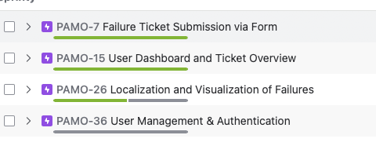
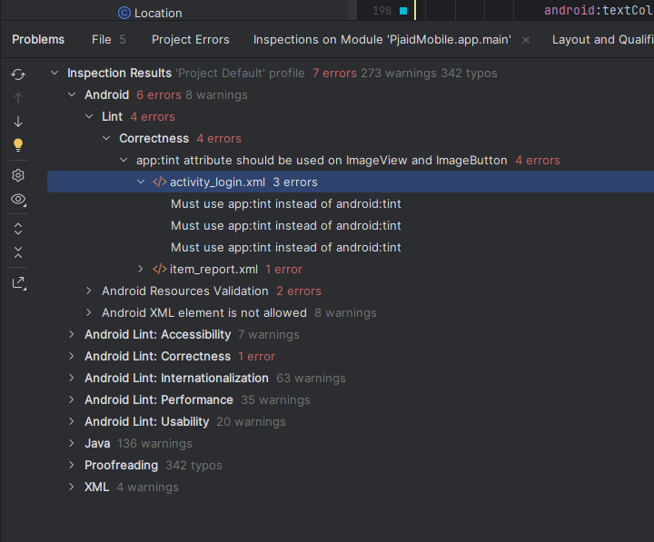
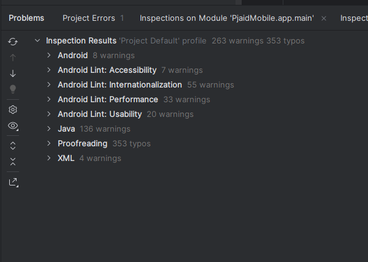

# Mobile Application for Reporting and Managing Device Failures within the PJAID System

MVP (Minimum Viable Product)
- Failure report registration
- QR code scanning
- User's list of reports
- Report details


## Team & task division

| Person              | Tasks                                                            |
|---------------------|------------------------------------------------------------------|
| Jakub Marcinkowski  | [ANDROID] Failure report form, User's list of reports            |
| Dagmara Gibas       | [ANDROID] Report details                                         |
| Karol Spica         | [ANDROID] Adding QR code scanning in the mobile app              |
------------------------------------------------------------------------------------------
## Short Description of the Application

PJAID Mobile is a mobile application for reporting and managing technical failures in industrial equipment, mainly targeted at technicians and maintenance personnel. The key features include:
-	Submitting reports via a dedicated form
-	Describing the issue, setting the status, and adding a location (via GPS or manually)
-	Viewing a user-specific list of reported issues
-	Editing and updating ticket details
-	Google Maps integration for location display
-   QR code scanning for identifying equipment

# Git usage instructions

Source code management in the project team was based on the GIT version control system. Below are the best practices followed during work with the repository.



## JIRA tasks

https://pjwstk-inz-team.atlassian.net/jira/software/projects/PAMO/boards/100/timeline?selectedIssue=PAMO-14

## Creating a Branch

- Before starting work on a new feature or fix, create a new branch.  
- This way, you won't interfere with the main branch of the project (main).  
- Each change should be implemented in a separate branch.  
- For longer work, commit changes regularly.

## Pull Request and Code Review

After finishing work on a feature:

1. Go to **GitHub** and create a **Pull Request (PR)**.  
2. Set **your branch** as the source, and **main** as the target.
3. Other team members perform a **Code Review**, which includes:
   - logic implementation check,
   - compliance with coding standards,
   - error verification.
4. Make corrections according to comments and commit again — changes will be automatically added to the existing PR.

## Testing and merging changes

- Before approving the PR, thoroughly test your branch.
- Make sure there are no errors and that all unit and integration tests pass.
- After successfully merging into `main`, delete your branch locally and remotely.

## Naming Conventions

### Branch names:

`SCRUM_TASK_NUMBER_short_description`

**Example:**  
`SCRUM_4_database_configuration`

### Commit messages:
```
[SCRUM 4] - short description of the committed changes
```

## Summary

1. Create a new branch before each change  
2. Commit changes regularly  
3. Create Pull Requests after finishing work  
4. Conduct Code Review before merging  
5. Merge only tested code  
6. Delete outdated branches

---

# Sonar usage instructions

- It is worth installing the **SonarQube for IDE** plugin for your IDE (for IntelliJ users).  
- The plugin adds the context menu option:  
  **"Analyze with SonarCube for IDE"**.  
- After launching this option, **information about what should be improved in the code** will appear.
- It's useful to have it installed locally, because **GitHub Actions** have been added to GitHub that **automatically run Sonar analysis**.
- If the code **does not pass the analysis**, the ability to merge it will be **blocked**

---

## Full CI/CD workflow used in the project


Source code is analyzed by SonarCloud for:
- bugs
- security vulnerabilities (Security Hotspots, Bugs, Code Smells)
- test coverage

# Sonar example


#IntelliJ analysis before corrections


#IntelliJ analysis after corrections


# Pull request example


# Commits example


Code documentation was maintained using JavaDoc. We tried to place comments at the class level and methods that we considered needed  
# Class comment example


# Method comment example


# Unit tests

## Tools:
**JUnit**  
– Testing framework for unit and instrumentation tests  
– Used for: `@Test`, `@Before`, `@After`, `assertEquals`, etc.

**Mockito**  
– Library for mocking objects and verifying interactions  
– Used for: `mock()`, `when()`, `verify()`, `@Mock`, `mockStatic()`

**Espresso**  
– UI testing library – interactions with views (`onView()`, `withId()`, `perform()`, `check()`)

**AndroidJUnitRunner**  
– Android runner for running instrumentation tests (`@RunWith(AndroidJUnit4.class)`)

## CreateTicketViewModelTest

This test class covers the core logic of submitting a failure report through the mobile app:

- `getCurrentLocation_shouldPostLocationToLiveData`: verifies that location is properly retrieved and stored.
- `submitTicket_shouldCallUseCaseExecute`: ensures that submitting a ticket calls the business logic handler (use case).
- `getCurrentLocation_shouldNotCrashOnError`: checks that the app handles location retrieval failures gracefully.

All dependencies are mocked to isolate the ViewModel logic from external services.


## Example classes with unit tests::
- GetDeviceByIdUseCaseTest.java – tests logic of retrieving a device
- SendReportUseCaseTest.java – tests logic of sending a report
- TokenAuthenticatorTest.java – tests JWT/token authorization logic


# Instrumented tests

## Example classes with instrumented tests:
- MainActivityTest.java – tests operation of  MainActivity
- CreateTicketActivityTest.java – tests the report submission screen

## Monkey test


## Requirements and Management – Checklist

Criterion
Status
Justification
1.Is a short description of the application provided?
- Included in this message and the final presentation.

2.Is a list of requirements and features provided?
- All features were defined as epics and stories in JIRA.

3.Is the task list provided?
- Tasks are documented in JIRA (e.g., PAMO-7, PAMO-15, PAMO-26, etc.).

4.Are tasks correctly assigned and equally distributed?
- Tasks were fairly distributed – visible in JIRA task history.

5.Are tasks clearly defined (Definition of Done)?
- Each task included a description, implementation steps, and a status.

6.Is access provided to P.Czapiewski?
- An invitation to both the repository and JIRA was sent earlier.

7.Is English used for all deliverables?
- Commit messages, task descriptions, and source code are all in English.


## Tools Used

- Language: Java (Android)
- IDE: Android Studio
- Libraries and Frameworks:
- Retrofit + RxJava (API communication)
- ZXing (QR scanning)
- Google Maps API (location services)
- Hilt (dependency injection)
- ViewBinding (UI binding)
- Project management: JIRA
- Version control: Git + GitHub
